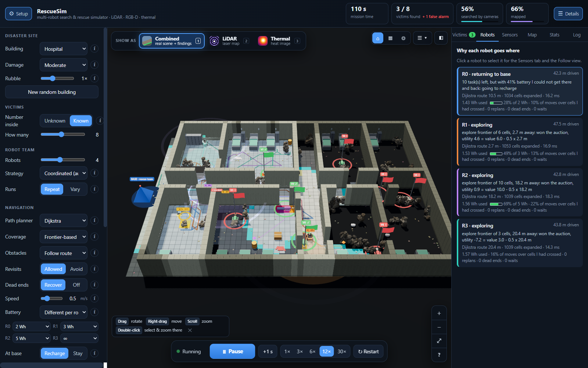

# 🚨 RescueThermal AI

A team of autonomous robots searches an unknown, damaged building for survivors. Each robot carries a **LiDAR**, a
**colour + depth camera** and a **thermal camera**. The robots map the building, search it with their cameras, recognise
people with a small neural network, share what they find, split the work between them, and report a map of victims to the
rescue team. Every mission is scored against the hidden ground truth.



📘 **Full explanation:** [docs/RescueThermal_AI_Guide.pdf](docs/RescueThermal_AI_Guide.pdf) is a 63-page guide to every
algorithm, sensor model and design decision, with diagrams and interview questions.

## Features

- **Procedural buildings**: office, apartments, hospital, school, parking garage and warehouse, with collapse, furniture,
  rubble, victims and look-alikes. An **open test ground** is included for checking the algorithms.
- **Simulated sensors**: a ray-cast LiDAR, an RGB-D camera and a thermal camera, with noise, blur, drift and dropouts.
  Heat does not pass through thick rubble.
- **Mapping**: a log-odds occupancy grid per robot, merged by radio. A separate "searched" layer drives exploration.
- **Victim detection**: a CNN (VictimNet, about 73k weights) trained on 20,000 simulated images turns frames into a person
  heatmap. A Bayesian belief filter, shared by the whole team, confirms a person only after repeated close looks.
- **Decision layers**:
  - coverage pattern: frontier, lawnmower or spiral;
  - team strategy: random, greedy, partition or auction;
  - route planner: Dijkstra, A*, RRT* or ant colony.
- **Robust motion**: replanning, bumper, probing, Dynamic Window Approach, dead-end recovery and a revisit penalty.
- **Batteries**: a physical energy model, per-robot capacities, energy-aware task choice, and recharge-and-resume.
- **3-D dashboard**: combined, LiDAR and thermal views, a plain-language reason for every robot decision, and a built-in
  algorithm comparison.

## Quick start

```bash
python -m venv .venv
.venv\Scripts\activate                  # macOS / Linux: source .venv/bin/activate
pip install -r requirements.txt
python -m rescue serve                  # open http://localhost:8001
```

The trained detectors are included in `models/`. Everything runs on a laptop CPU. Press **▶ Start** to send the robots in.

Alternatively, `streamlit run streamlit_app.py` runs the same dashboard in Streamlit, and it can be deployed on
Streamlit Community Cloud with `streamlit_app.py` as the main file.

## How it works

Every simulated second, each robot runs **sense → detect → communicate → decide → act**:

| Layer | Question | Implementation |
|---|---|---|
| Mapping | What is around me? | LiDAR + depth camera + bumper → log-odds evidence grid (`mapping.py`) |
| Perception | Is that a person? | CNN heatmap → depth → position → 40 °C check → belief filter (`perception.py`, `victims.py`) |
| Coverage | Where do I search next? | frontier, lawnmower or spiral pattern (`coverage.py`) |
| Strategy | Which robot takes which task? | random / greedy / partition / auction on value − 0.5 × distance (`coordination.py`) |
| Planning | How do I get there? | Dijkstra / A* / RRT* / ant colony on an 8-connected grid (`planners.py`) |
| Motion | How do I drive safely? | turn-then-drive timing, DWA, dead-end recovery, battery rules (`motion.py`, `simulator.py`) |

## Results

4 robots, 12 missions per sensor set in the six damaged building types, scored against the ground truth (`scripts/reliability.py`):

| Sensors | Findable victims found | Precision |
|---|---|---|
| Colour camera | 80 / 102 | 85 % |
| Thermal camera | 99 / 102 | 83 % |
| Colour + thermal | **100 / 102** | **88 %** |

- On the open test ground, Dijkstra and A* always find the optimal route; RRT* and the ant colony come within about 1 % of it
  (`scripts/check_algorithms.py`).
- Lawnmower and spiral robots stay within 0.21–0.29 m of their pattern on average.
- Victims buried under thick rubble have no heat signature. No camera can find them, and the results report them separately.

## Commands

```bash
python -m rescue serve                          # 3-D dashboard
python -m rescue simulate --strategy coordinated
python -m rescue benchmark --seeds 8            # compare strategies and vision modes
python -m rescue train                          # retrain the three detectors (CPU, about 50 min each)
python scripts/check_algorithms.py              # planners and coverage patterns → results/algorithms/
python scripts/reliability.py                   # detection reliability → results/reliability/
python -m pytest                                # 92 tests
python docs/guide/build.py                      # rebuild the guide PDF (needs Edge or Chrome)
```

## Project structure

```
rescue/            simulation package: world, thermal, lidar, sensors, mapping, perception, victims,
                   coverage, coordination, planners, motion, simulator, metrics, server
rescue/web/        three.js dashboard (plain ES modules)
models/            trained detectors (.pt) and their test scores (.json)
scripts/           experiments: algorithm checks, reliability study, team-size study
tests/             pytest suite
docs/              the project guide (PDF) and its sources
results/           figures and measurements
```

## Limitations

Robots know their exact position (no SLAM), move on a 0.5 m grid, and live in a 2.5-D single-floor world. Temperatures
are simulated, and the detector has only seen simulated images. Chapter 15 of the guide explains each simplification
and what a real robot would need.
