# 🚨 RescueThermal AI — Autonomous Thermal Vision for Disaster Victim Detection

A team of autonomous robots searches a damaged building for survivors. The robots have never
seen the building. Each carries a **LiDAR** (a spinning laser that measures the distance to the
walls all around), a **colour + depth camera** and a **thermal camera**, and a small neural
network that recognises people in what the cameras see. The robots **map the building with the
laser, search it with the cameras, spot heat signatures and human shapes, share what they find,
double-check uncertain sightings, split the work between them, and build a map of suspected
victim locations** for the rescue team. Every mission is scored against the hidden ground truth,
so you can measure how much each sensor, the AI and the teamwork actually help.

**The simulation is honest about what the sensors cannot do.** Heat does not pass through thick
rubble or concrete: some of the simulated victims are buried under it and have no heat signature
at all; no camera, thermal or colour, can find them, and the results say so instead of
pretending otherwise. The LiDAR sees nothing lower than its scan plane and cannot tell a person
from a box, so it maps but never finds anyone.


---

## Contents

1. [Quick start](#1-quick-start)
2. [Using the dashboard](#2-using-the-dashboard)
3. [The big picture: one robot, one second](#3-the-big-picture-one-robot-one-second)
4. [The disaster site: six kinds of building](#4-the-disaster-site-six-kinds-of-building)
5. [How a robot senses: LiDAR and two cameras](#5-how-a-robot-senses-lidar-and-two-cameras)
6. [What thermal imaging can and cannot do](#6-what-thermal-imaging-can-and-cannot-do)
7. [How a robot recognises a victim](#7-how-a-robot-recognises-a-victim)
8. [The thermal map and the victim map](#8-the-thermal-map-and-the-victim-map)
9. [How a robot decides where to go](#9-how-a-robot-decides-where-to-go)
   * [9a. Navigation in depth: routes, coverage, obstacles, energy](#9a-navigation-in-depth-routes-coverage-obstacles-energy)
10. [The four team strategies](#10-the-four-team-strategies)
11. [Known vs unknown number of victims](#11-known-vs-unknown-number-of-victims)
12. [How robots move without crashing](#12-how-robots-move-without-crashing)
13. [Measuring performance](#13-measuring-performance)
14. [Results](#14-results)
15. [Command line](#15-command-line)
16. [Project structure](#16-project-structure)
17. [Glossary](#17-glossary)
18. [Limitations and next steps](#18-limitations-and-next-steps)

---

## 1. Quick start

```bash
cd multi-robot
python -m venv .venv
.venv\Scripts\activate                 # Windows   (macOS / Linux: source .venv/bin/activate)
pip install numpy scipy matplotlib scikit-learn pillow pytest
pip install torch --index-url https://download.pytorch.org/whl/cpu

python -m rescue serve                  # then open  http://localhost:8001
```

The three trained neural networks are included (`models/victim_detector.pt` for the colour
camera, `models/thermal_detector.pt` for the thermal camera, `models/fusion_detector.pt` for
both), so the dashboard works straight away. Everything runs on a normal laptop CPU.

The page opens with the robots waiting at the entrance. Press **▶ Start** (or the space bar) to
send them in, **⏸ Pause** to stop the clock, **+1 s** to go one second at a time.

### Run it with Streamlit, or put it online

The same dashboard also runs inside Streamlit:

```bash
pip install -r requirements.txt        # includes streamlit and the CPU build of PyTorch
streamlit run streamlit_app.py         # then open  http://localhost:8501
```

`streamlit_app.py` shows the unchanged 3-D dashboard as a Streamlit component. Instead of calling
the web server, the page sends each request (reset, step, camera image, comparison…) to Python as
the component's value; Streamlit reruns the script, which answers with the same code the web server
uses (`rescue.server.Session`). Every browser tab has its own mission. Each request costs Streamlit
about 0.4 s, so the page asks for several simulated seconds at once; playback is about as fast as
with `python -m rescue serve` (the camera AI is the real limit).

**Streamlit Community Cloud** (free):
1. Put the project on GitHub (the repository must contain `streamlit_app.py`, `requirements.txt`,
   `rescue/`, `models/` and `.streamlit/config.toml`).
2. Go to **share.streamlit.io**, sign in with GitHub, click **Create app → Deploy a public app from
   GitHub**, pick the repository, branch `main` and main file `streamlit_app.py`.
3. Under **Advanced settings** choose **Python 3.12**, then **Deploy**. The first build installs
   PyTorch and takes a few minutes.

A free app has one shared CPU and little memory, so missions run slower than on a laptop, and the
*Compare algorithms* feature runs two missions at a time (set the `RESCUE_WORKERS` secret or
environment variable to change that). An app that nobody opens for a while goes to sleep and wakes
up on the next visit.

---

## 2. Using the dashboard

The screen has three parts. The **3-D view** in the middle is where the mission happens; the
**setup** panel (left) and the **details** panel (right) can each be hidden with the *Setup* and
*Details* buttons in the top bar, which leaves the whole window to the 3-D view.

### The transport bar (on the 3-D view)

| Control | What it does |
|---|---|
| **▶ Start / ⏸ Pause / ▶ Resume** | starts the mission, stops the clock, continues. Space bar does the same. When the mission is over the button becomes **↻ Run again**. |
| **+1 s** | advances exactly one second (full stop key). Useful for watching one decision. |
| **1× 3× 6× 12× 30×** | how many simulated seconds pass per real second |
| **↻ Restart** | same building, same settings, back to the start |
| status light | Ready (blue), Running (green), Paused (amber), Finished (purple) |

A mission never starts by itself. After any change of the setup the robots go back to the
entrance and wait for **Start**.

### Three pictures of the same building ("Show as", top left of the 3-D view)

The robots carry two technologies, and each can be looked at on its own or together:

| Picture | What it shows | Key |
|---|---|---|
| **Combined** | the building as it is, plus the laser's hits (light dots around each robot) and the warm spots the thermal cameras found (orange floor patches) | 1 |
| **LiDAR** | only what the laser knows: **violet** where beams hit something, dark blue where the floor is free, black where nothing is mapped, on a 1 m grid. A bright line on each object marks the **scan plane** (40 cm), the only height the laser measures; the dotted outline is the point cloud of every wall the beams traced. While the mission runs, a ring sweeps out from each robot to the laser's range. People lying on the floor stay dark, because the beams pass over them. | 2 |
| **Thermal** | only what the thermal cameras measured, in the colours of a thermal camera (smoothed like a real thermal image): dark purple is cold, orange and yellow are warm, white is hot. Anything warmer than the air glows. Hatched floor has not been looked at by any thermal camera yet. | 3 |

A picture is only offered when the robots carry the sensor for it. The LiDAR and Thermal pictures
show a read-out on the right like the screen of the real instrument: scan plane, range and mapped
share for the laser; the temperature scale, the air temperature and the hottest reading so far for
the thermal cameras.

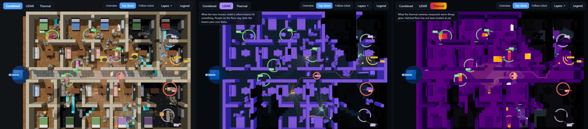

### Mission setup (left)

1. **Disaster site.** One of six **building types**, or the **open test ground** for checking the
   algorithms, and a **damage level** (light / moderate / severe). Changing either creates a new random building of that kind; *New random building*
   gives another layout. The damage level also decides how many victims are partly buried, fully
   covered by thin debris, or **buried under thick rubble (undetectable)**.
2. **Victims.** *Unknown* is the usual real-life case: you only see victims once the robots
   find them, the robots search the whole building, and at the end you can press *Reveal* to
   learn how many people were really inside and how many were buried beyond any camera's
   reach. *Known* lets you set the number; you then see every victim from the start and the
   robots stop as soon as they have confirmed that many.
3. **Robot team.** Number of robots (1–8), the **strategy**, and **Runs**: *Repeat* gives exactly
   the same mission for the same settings (fair comparisons); *Vary* keeps the building but draws
   new random numbers every run, so the robots take different paths.
4. **Navigation** (section 9a): **path planner** (Dijkstra, A*, RRT*, ant colony), **coverage**
   pattern (frontier, lawnmower, spiral), **obstacles** (follow the route, or Dynamic Window
   Approach), **revisits** (allowed, or avoid ground already driven over), **dead ends**
   (recover or not), **speed** (0.2–1.5 m/s) and **battery** (unlimited, 1–10 Wh, or a different
   battery per robot; with a battery, **at base**: recharge and go back out, or stay). The
   *Disaster site* section also has a **rubble** slider (obstacle density, 0–3×).
5. **Sensors on the robots.** One choice, plus the **camera range** (2–8 m) and **LiDAR range**
   (3–20 m):

   | Choice | The robots carry | What happens |
   |---|---|---|
   | **Combined** | LiDAR + colour camera + thermal camera | the laser maps the building, the cameras find the people |
   | **Vision + Thermal** | the two cameras only | an AI reads the colour and the thermal image together and finds people; the map grows only where the depth camera looks |
   | **LiDAR** | the laser only | the building gets mapped quickly, but **nobody is found**: a laser cannot recognise people |

Every setting has an **ⓘ** button that opens a short explanation in plain words. An orange box
states what the sensors cannot do. Changing victims, team, strategy or sensors restarts the
mission **in the same building**, so you can compare fairly. A setup can also be put in the
address bar, e.g.
`http://localhost:8001/?building=parking&damage=severe&sensors=cameras&show=thermal&known=1&seed=42`.
Navigation settings work the same way: `planner=astar|rrtstar|aco`, `coverage=boustrophedon|spiral`,
`avoidance=dwa`, `revisit=0.3`, `deadend=0`, `rspeed=0.8` (m/s), `battery=2` (Wh), `battery_each=1,2,3,0`
(Wh per robot, 0 = unlimited), `recharge=0`, `camrange=6`,
`lidarrange=12`, `density=2`, `vary=1`.

### What you see in 3-D

| On screen | Meaning |
|---|---|
| 🟩 **green flag "V3 ✓"** above a person | a victim the team has **found** (confirmed) |
| 🚩 **red flag "V3 !"** (known count only) | a victim **not found yet**; the ring pulses |
| 🟧 **amber flag "V3 ?"** (known count only) | a robot **spotted something** there and the team is checking |
| 🟪 **purple flag "V3 ⛏"** over a rubble mound (known count or after *Reveal*) | a victim **buried under thick rubble**: no heat signature, **no camera can detect this person** |
| red ring with **"✕ false alarm"** | the robots **confirmed** a person here, but nobody is there (a dog, a heater, a jacket...) |
| amber ring with **"⧉ counted twice"** | a real person the robots had already counted, confirmed again further than 1.6 m from the first report |
| amber **"? 62 % · 33°C"** marker | what the robots *believe*: an unconfirmed sighting, how sure they are, and the temperature they measured |
| grey **"✕ rejected"** | a sighting the robots checked and rejected |
| **ring of light dots around a robot** with faint beams | its latest **LiDAR scan**: where the laser beams ended |
| coloured rover R0, R1... with a light wedge | a robot and what its cameras can see |
| coloured line + spinning diamond | the robot's planned path and current goal |
| **bright floor** | **searched**: a camera has looked at it |
| **dim floor** | **mapped** by the LiDAR, but no camera has looked there yet |
| **dark floor** | not on the map yet |
| **cyan floor** | the edge of the searched area, where the robots go next |
| **orange / yellow floor patches** | warm spots: the warmest reading a thermal camera ever took in that cell |
| tinted floor + "Zone of R2" labels | the zones of the **partition** strategy |

**Overview**, **Top-down** and **Follow robot** (top right) choose the camera. **Layers** switches
flags, shading, paths, view cones, sightings and zones on or off; **Legend** shows the colour key
of the current picture. When the 3-D view is narrow these buttons show only their icons; hover for
the name.

### Moving around and selecting

| Mouse / key | What it does |
|---|---|
| drag | rotate around the centre of the view |
| right-drag | slide along the floor |
| scroll | zoom towards the centre of the view |
| **double-click** | **select** what is under the mouse: the camera glides to it and it becomes the centre, so rotating and zooming now happen around it |
| **+ / − / ⤢** buttons (bottom right), keys **+ −** | zoom in, zoom out, show the whole building |
| **F** | fly back to the selection (or to the whole building) |
| **Esc** | clear the selection |

The selected spot is outlined in blue and a card (bottom left) says what is there (a wall, a
storage rack, a desk, a victim, a robot…) and what each sensor of the team knows about it: whether
the LiDAR mapped it as obstacle or free, the temperature the thermal cameras measured, and whether a
camera has searched it. For a robot the card shows its task and its reason, and **Follow this
robot** rides behind it. The card updates while the mission runs.

### Details (right), one tab at a time

| Tab | What it shows |
|---|---|
| **Victims** | the count in one line, **confirmed by the robots = real victims + false alarms**, then every victim and how they lie, then every false alarm and what it really was. Click any of them to fly there. |
| **Robots** | for every robot, what it is doing and **why**, e.g. *"explore frontier of 8 cells, 6.5 m away: won the auction, utility 4.7 = value 8.0 − 0.5 × 6.5 m"*. Click a robot to select it. |
| **Sensors** | what the selected robot senses, each in its own picture: the **thermal image**, the **colour image** (both with the AI's detections) and the **LiDAR scan** seen from above, with the cameras' field of view drawn in for comparison |
| **Map** | the 2-D **victim map** the team would hand to rescuers, with a colour key and an *Export* button (JSON) |
| **Stats** | performance numbers and the progress chart (mapped, searched, victims found) |
| **Log** | every event in plain words, with the ground truth: *"R1's thermal camera sees a 58 °C object at (12.3, 4.1) m: far too hot for a person, ignored (ground truth: a space heater at 58 °C, not a person)."* |

Only the open tab is redrawn while the mission runs, which keeps the page light.

### How people are counted

The same three numbers appear in the top bar, the Victims tab, the map and the mission summary:

```
confirmed by the robots  =  real victims  +  false alarms  +  people counted twice
```

* A **real victim** is a confirmed report within 1.5 m of a person. One report counts one person.
* A **false alarm** is a confirmed report with nobody there. The robots cannot know this; the
  simulator does, and the dashboard marks it in red so that it is never mistaken for a victim.
* A person **counted twice** is a real person confirmed a second time, more than 1.6 m from the
  first report. It is marked in amber ("⧉ counted twice"): it is an error in the count, not a phantom.
* **Repeated reports are merged.** A lying body is 1.75 m long, and its head and legs can look
  like two separate warm shapes. Confirmed sightings closer than 1.6 m are therefore one person,
  in the robots' own count as well as in the score. The Victims tab says how many were merged.

---

## 3. The big picture: one robot, one second

The simulation runs in steps of **1 second**. Every step, every robot runs the same loop:

```
        ┌─────────────────────────────────────────────────────────────────────┐
        │  1. SEE        LiDAR → distance to the walls all around → my map     │
        │                depth camera → floor and low obstacles ahead → my map │
        │                thermal camera → warmest reading of every visible cell│
        │  2. SPOT       neural network on the camera image(s) → "person?"     │
        │                anything hotter than 40 °C is dropped (not a person)   │
        │  3. SHARE      swap maps + sightings with the team                   │
        │  4. BELIEVE    fuse all sightings → candidate / confirmed / no        │
        │  5. DECIDE     pick a goal: explore a frontier or check a sighting   │
        │  6. MOVE       one step (0.5 m) along the shortest safe path         │
        └─────────────────────────────────────────────────────────────────────┘
```

**Robots only use their own knowledge.** The simulator knows where the victims really are, but
uses that only to draw camera images and to score results, never to make a robot's decision.
That is what makes them *autonomous*. (`rescue/simulator.py`, `Simulator.step`)

---

## 4. The disaster site: six kinds of building

`rescue/world.py` generates a new building each time: 28 m × 20 m, with the entrance on the left.

| Building | Layout | Furniture (real obstacles) | Ambient temperature |
|---|---|---|---|
| **Office** | open-plan floor, meeting rooms and private offices along two walls, a solid lift/stair core | desk clusters with monitors and chairs, meeting tables, filing cabinets | 20 °C |
| **Apartment block** | a central corridor with flats on both sides; each flat has a living room and a bedroom | sofa, dining table, kitchen counter, bed, wardrobe | 21 °C |
| **Hospital** | two corridors crossing; wards on both sides; reception near the entrance | hospital beds with rails and IV poles, bedside cabinets, reception counter | 22 °C |
| **School** | classrooms along a corridor, and a large gym | rows of school desks and chairs, teacher's desk, bookshelves, bleachers, court lines | 19 °C |
| **Parking garage** | two rows of painted bays, a wide driving lane, pillars, a stairwell | parked cars (they block the camera's view; some have **warm engines**) | 13 °C |
| **Warehouse** | offices along the top, a big hall | pillars and tall pallet racks full of cartons | 15 °C |
| **Open test ground** (*plain*) | one empty hall, the same every time: made for checking the coverage patterns and route planners (section 9a) | a 2 × 2 m block in the middle, two crates, cabinets in the four corners, shelves and counters along the walls; no rubble, no look-alikes, no warm objects | 20 °C |

| | | |
|---|---|---|
| 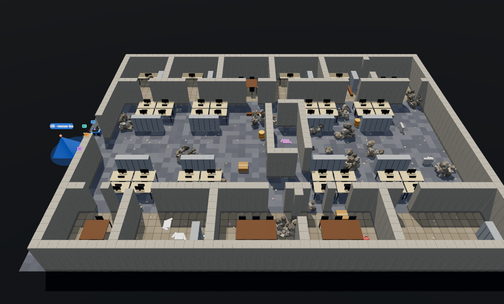 **Office** | 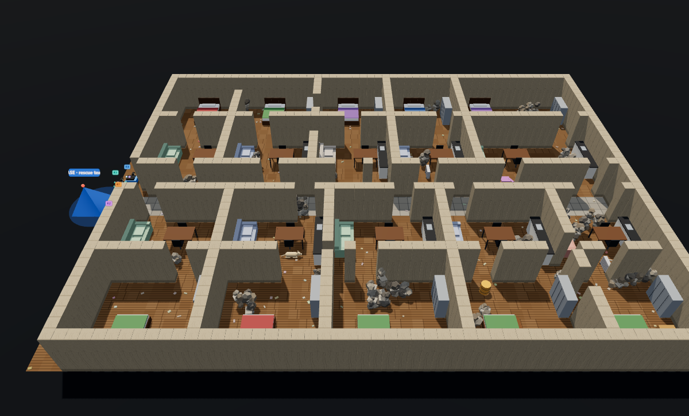 **Apartment block** | 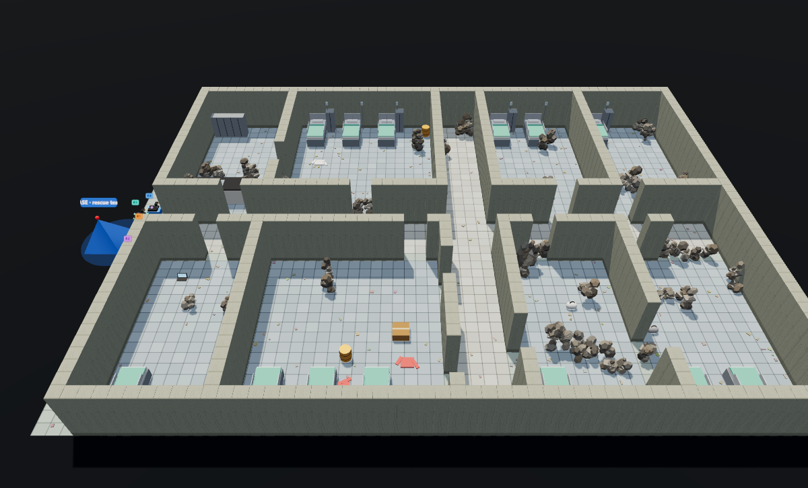 **Hospital** |
| 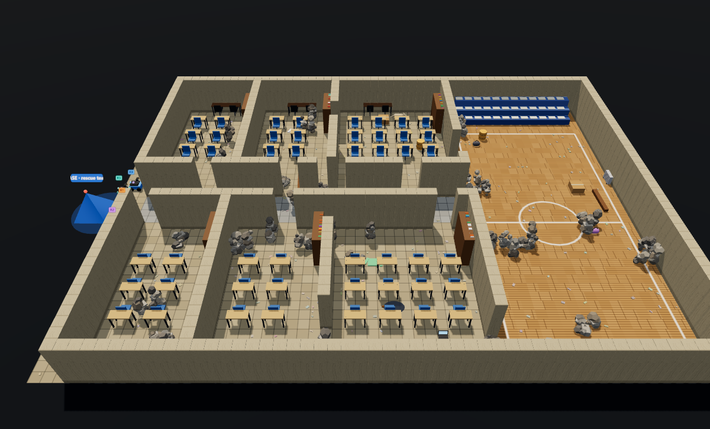 **School** | 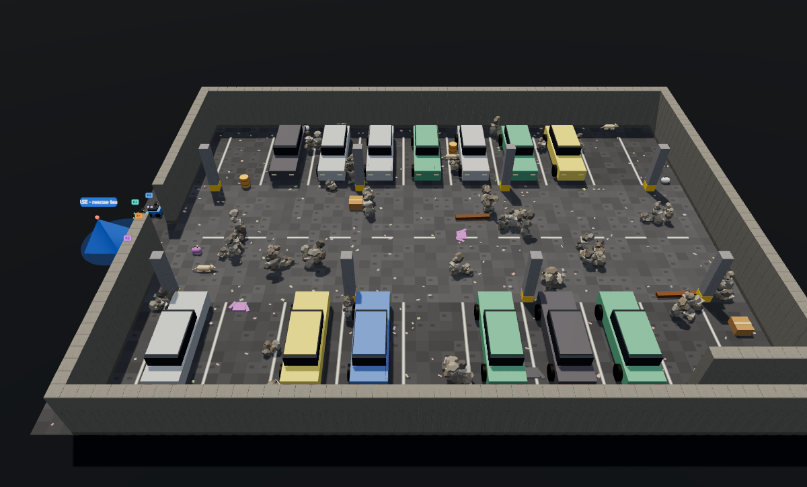 **Parking garage** | 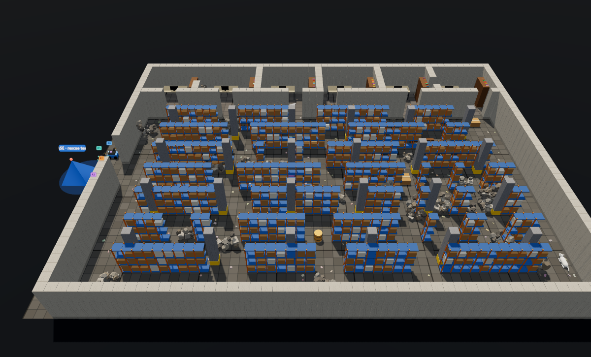 **Warehouse** |

Furniture is part of the simulation, not decoration: robots must drive around it, and anything
taller than the camera (desks, shelves, cars, racks, sofas) blocks the view. Every piece is only
placed if it does not cut off part of the building.

**Damage level** controls how many walls have collapsed (leaving gaps and rubble), how much rubble
lies around, how cold the building has become (collapsed walls let outside air in), and how the
victims lie:

| damage | walls collapsed | partly buried | whole body under **thin debris** | whole body under **thick rubble** |
|---|---|---|---|---|
| light | 10 % | 20 % | 5 % | 0 % |
| moderate | 25 % | 40 % | 10 % | **10 %** |
| severe | 45 % | 60 % | 10 % | **20 %** |

**Victims** are people lying on the floor, each with random skin tone and clothing, at least 2 m
apart. Two kinds of objects exist only to fool the robots:

* **Look-alikes** (fool a colour camera): jackets, bags, cardboard boxes, wooden beams, barrels.
  They are at room temperature, so a thermal camera sees straight through the trick.
* **Warm objects** (fool a thermal camera): space heaters (42–60 °C), laptops still running on
  battery (34–42 °C), hot-water leaks from burst pipes (28–38 °C), pets (a dog, 31–36 °C),
  sun-warmed rubble (28–36 °C) and, in the parking garage, cars whose engine ran recently
  (bonnet 40–65 °C). Which kinds appear depends on the building (`rescue/thermal.py`).

The building is stored at two resolutions: a **0.5 m navigation grid** (what robots plan on) and a
**0.25 m 3-D heightfield** (height, colour **and surface temperature** of everything, what cameras
render).

---

## 5. How a robot senses: LiDAR and two cameras

Each robot carries three sensors, and each answers a different question.

| Sensor | Sees | Range | Answers | Cannot do |
|---|---|---|---|---|
| **LiDAR** (2-D laser scanner) | distance to the nearest surface, in 240 directions all around | 8 m | *"Where are the walls? Where can I drive?"* | see anything lower than its scan plane (40 cm); tell a person from a box |
| **Colour + depth camera** | a colour image and the distance of every pixel, 90° wide | 5 m | *"What lies on the floor ahead? Does it look like a person?"* | see in the dark without the headlamp; see a body under debris |
| **Thermal camera** | the surface temperature of every pixel, 90° wide | 5 m | *"Is something warm there?"* | see through thick rubble; tell a person from a dog by warmth alone |

### 5.1 LiDAR: mapping the building (`rescue/lidar.py`)

Once per second the laser makes a full turn. In each of 240 directions (1.5° apart) a beam
travels until it meets a surface that crosses the **scan plane**, 40 cm above the floor, and the
sensor reports the distance. The readings carry 2 cm of noise and about 1 % of the beams return
nothing.

**From a scan to a map (`rescue/mapping.py`).** One noisy scan is never trusted on its own. Each
robot keeps an **evidence grid** (a probabilistic occupancy grid, the standard method since
Moravec & Elfes, 1985): every 0.5 m cell holds the log-odds that it is occupied.

* A beam that **passes through** a cell lowers its evidence by 0.45; a beam that **ends** in it
  raises it by 0.9. Inside one scan a cell only counts as "hit" when more beams ended in it than
  passed through it, which filters out beams that clip a corner.
* A cell is called FREE below −0.8 and OBSTACLE above +0.8; in between it stays UNKNOWN.
* The laser alone never gets more certain than ±2.5. What the **depth camera** saw from close by,
  or the **bumper** felt, counts as certain (±4) and always wins.
* When robots talk they keep, for every cell, the strongest opinion anyone has.

**Why the cameras are still needed for the map.** A person lying on the floor is 20–30 cm high:
every laser beam passes over them, so the LiDAR calls that cell free. The same goes for jackets,
bags, laptops, low rubble and the dog. The depth camera sees those inside its narrower field of
view and marks them as obstacles for good; if a robot drives into one before any camera saw it,
the bumper stops it, the cell becomes an obstacle, and the robot plans a new route.

**Mapped is not searched.** The LiDAR map usually reaches further than the cameras have looked.
The robots drive on the *map*, but only a camera can *search* a cell for people, so exploration
goals sit at the edge of the **searched** area (see [section 9](#9-how-a-robot-decides-where-to-go)).
In the dashboard, dim floor is mapped but not searched; bright floor is searched.

**An obstacle the laser found still has to be looked at.** A heap the laser bounced off may be
rubble lying on a person. So a cell counts as searched only when a camera has looked at it,
whatever the laser says about it. (An earlier version skipped such cells, and a robot team with
perfect eyes once drove past a partly buried person in a school: the rubble on the legs was
60 cm high, the laser called it an obstacle, and nobody pointed a camera at it. A test now
replays that mission.)

### 5.2 The two cameras (`rescue/sensors.py`)

The **RGB-D camera** (colour + depth, like an Intel RealSense) and the **thermal camera** bolted
next to it (like a FLIR Lepton or Boson core) sit 0.55 m high, look 14° down, are 90° wide, reach
5 m and deliver 64 × 48 pixels.

**What they cover (`sensors.visible_cells`):** about 60 **rays** are cast across the field of view.
Each ray walks forward until it hits something taller than the camera. Every cell it passes counts
as **searched**, goes into the map as FREE or OBSTACLE (low obstacles included), and gets the
**warmest temperature** inside it written into the team's thermal map.

**The camera images (`sensors.render`):** a real 3-D perspective image made by **ray marching**.
For each pixel a ray travels through the 3-D model in 7 cm steps until it hits the floor or an
object, giving the colour, the **depth**, the exact 3-D point, and the **surface temperature** of
what it hit.

* The **colour image** is dark and lit only by the robot's headlamp (light falls off with
  distance); dust haze, exposure changes and sensor noise are added.
* The **thermal image** needs no light at all: it is just as clear at the far end of a dark room
  and through dust. It is blurrier than the colour image (thermal optics are soft, σ = 0.8 px),
  every pixel carries about 0.25 °C of sensor noise, and the whole frame drifts by up to ±0.3 °C
  from one image to the next, like a real uncooled thermal core.

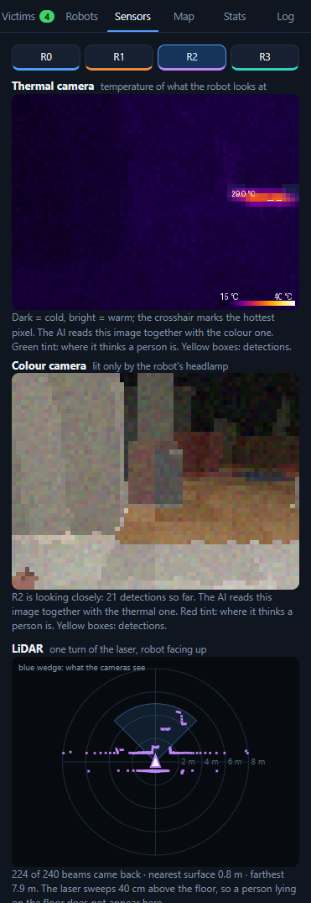

*The Sensors tab while a robot takes a close look at a sighting. Top: the thermal image in the
colours of a thermal camera; the crosshair marks the hottest pixel. Middle: the colour image, lit
only by the headlamp. Yellow boxes are the AI's detections; the tints show where it thinks a
person is. Bottom: one turn of the LiDAR, with the cameras' field of view as a blue wedge.*

### 5.3 The temperature model (`rescue/thermal.py`)

Every 25 cm cell of the world has a surface temperature:

* The building sits at its **ambient** temperature (table above) minus 0.5–3 °C for collapsed
  walls, with slow spatial drift (draughts, sunlit patches, ±0.8 °C) and noise. Concrete and steel
  read 0.6 °C cooler than the air.
* **People are warm.** Exposed skin (the head) reads 33–36 °C; clothing insulates, so shirt and
  trousers read 4–7 °C cooler. Half of the victims have been trapped long enough to cool by up to
  4 °C (hypothermia).
* **Rubble on a body blocks the heat.** The warmth that leaks through a cover falls off as
  `exp(−thickness / 0.10 m)`:

  | cover | thickness | surface shows | who can see it |
  |---|---|---|---|
  | none (exposed) | 0 | full body heat | colour camera and thermal camera |
  | partly buried | 35–60 cm of rubble on part of the body | the exposed part only | both cameras (the exposed part) |
  | **thin debris** over the whole body | 6–14 cm of dust and light debris | a faint warm patch, 2–6 °C above the surroundings | **thermal camera only** |
  | **thick rubble** over the whole body | 40–80 cm of concrete rubble | **nothing** (< 0.1 °C) | **nobody** |

---

## 6. What thermal imaging can and cannot do

This is the heart of the project, so it is stated plainly.

**What it can do.** A thermal camera measures the infrared radiation every surface emits, which
depends on its temperature. A living person is warmer than a collapsed building, so an exposed
body shows up as a bright shape even in complete darkness and through dust, where a colour camera
sees only its own headlamp beam. Objects that fool a colour camera (a jacket, a bag, a box) are
cold and are not fooled for. Heat also conducts through **thin** layers: a person under a blanket
of dust and light debris still produces a faint warm patch on the surface. In the simulation these
"thin cover" victims are the ones **only the thermal camera can find**.

**What it cannot do.** Infrared radiation does not travel through solid matter. A person under
40–80 cm of concrete rubble warms the rubble by less than a tenth of a degree, far below the
camera's own noise. **Such a person has no heat signature and no camera, thermal or colour, can
detect them.** Thermal imaging also has its own false alarms: anything warm and roughly
body-sized looks like a person (a dog, a hot-water leak, a laptop, sun-warmed rubble), and hot
objects (heaters, engines) are bright blobs too.

**How the simulation accounts for it.**

1. Victims buried under thick rubble are generated on purpose (10 % at moderate damage, 20 % at
   severe). Their heat signature really is zero, the detectors were **never trained to see
   them**, and *perfect eyes* cannot see them either.
2. Every result reports them separately: "8 / 10 found; 2 buried under thick rubble: no camera
   can detect them; recall on the 8 detectable victims 100 %". The dashboard marks them with a
   purple flag and a rubble mound, the mission summary says how many there were, and the exported
   victim map carries a written limitation note.
3. A physics check runs **before** the AI is trusted: nothing on a living person is hotter than
   40 °C, so a "person" hotter than that is dropped and logged as a heater or an engine.
4. Warm non-human objects exist in every building so that the thermal detector has to learn what
   a person looks like to a thermal camera, not just "anything warm".

In the field, victims under thick rubble are found with **acoustic listening devices, search dogs,
radar and rescuers digging**, not with cameras. The exported victim map says so.

---

## 7. How a robot recognises a victim

Two stages: a **neural network** guesses on single images, then a **belief filter** decides what
to trust.

### 7.1 Three neural networks, one architecture

`rescue/perception.py`: a small **fully convolutional network** (≈73,000 parameters) that outputs
a 12 × 16 heatmap, the probability that each 4 × 4-pixel patch of the image shows part of a
person. Three copies were trained, differing only in what they look at:

| vision mode | input channels | what it learns |
|---|---|---|
| **colour camera** (`cnn`) | red, green, blue, depth (4) | human shapes and colours under a headlamp |
| **thermal camera** (`thermal`) | temperature, depth (2) | warm body-shaped patches, even faint ones under thin debris |
| **fusion** (`fusion`) | red, green, blue, depth, temperature (5) | both: a warm shape that also looks like a person |

```
input   C × 48 × 64    (C = 4, 2 or 5 channels)
        conv 3×3 (16) → conv 3×3 (16) → max-pool             → 24 × 32
        conv 3×3 (32) → conv 3×3 (32) → max-pool             → 12 × 16
        conv 3×3 (48) → dilated conv (×2) → dilated conv (×4)   (wider context)
        conv 1×1 → sigmoid
output  12 × 16 heatmap: probability that each 4×4-pixel patch shows part of a person
```

**Training data comes from the simulator** (`python -m rescue train`): 200 random buildings of
all six types and damage levels, 100 camera views each (20,000 images, rendered once with all five
channels). About 30 % of views are random, 32 % aim at a person (exposed, partly buried, under thin
debris or under thick rubble) and 38 % at a **hard negative**: a look-alike, a warm object or a
warm car bonnet. Every patch is labelled automatically from the renderer, with no manual
labelling. **Body parts under rubble are never labelled "person" for the colour network, and only
labelled for the thermal networks when the cover is thin enough (< 20 cm) for heat to leak
through**: no network is asked to see through concrete. Loss: weighted binary cross-entropy;
AdamW; 20 epochs; mirror augmentation.

**Test on 4,000 images from 40 buildings the networks never saw** (`models/*.json`):

| detector | input channels | ROC-AUC (ranks person images above others) | heatmap AP (locates the person in the image) | image recall | image precision |
|---|---|---|---|---|---|
| colour camera | 4 | **0.969** | **0.93** | 93 % | 72 % |
| thermal camera | 2 | **0.990** | **0.98** | 98 % | 82 % |
| fusion (both) | 5 | **0.994** | **0.99** | 98 % | 83 % |

### 7.2 From heatmap to map position, with a temperature

Patches with probability **≥ 0.85** are grouped into detections; the highest value is the
**confidence**. The **depth** at that spot plus the camera's position gives the person's (x, y)
position on the map. With a thermal camera the **warmest pixel in the patch** is attached as the
detection's temperature; if it is above **40 °C** the detection is dropped and logged ("far too
hot for a person"). This check is physics, not learning, and it catches heaters and engines
before they ever reach the belief filter.

### 7.3 The belief filter: why one image is never trusted

`rescue/victims.py` keeps a **belief** for every sighted spot using **Bayesian evidence in
log-odds**: `logodds(p) = ln(p / (1 − p))` (0.5 → 0, 0.9 → +2.2, 0.97 → +3.5), so evidence can
simply be added up.

* A new sighting starts a **candidate** at **−0.6** (most first glimpses are wrong).
* Each detection nearby adds `w × logodds(confidence)`, where **w = 1.0 for a close look
  (≤ 2.5 m)** and 0.55 from further away. The warmest temperature reported is kept for display.
* Each **close look that sees nobody** adds **−0.9**.
* Detections within 1.3 m of each other are treated as the same person.

A detection counts when the network's heatmap reaches **0.92**. A candidate is **CONFIRMED** only
when all three hold: evidence **≥ 9.0**, seen in **≥ 6 separate camera frames**, and **at least
one close look (≤ 2.5 m)**. It is **REJECTED** when
evidence falls to **−1.5**. An inconclusive close look is retried **from a different side** (a buried
person may be visible from one angle only), up to 4 times.

**One person, one report.** Confirmed sightings closer than **1.6 m** to each other are treated
as the same person (a body is 1.75 m long; with rubble on the torso, head and legs look like two
warm shapes). The one confirmed first is kept. This is also the number the robots compare with
the expected count when the number of victims is known.

**Worked example: a partly buried victim seen by the thermal camera**

| time | event | evidence | status |
|---|---|---|---|
| 12 s | R2's thermal camera picks up a 31 °C signature 4.6 m away, confidence 0.93 | −0.6 + 0.55 × 2.59 = **0.8** | candidate ("? 69 % · 31°C") |
| 13 s | R2 again from 4.2 m, 0.94 | 0.8 + 0.55 × 2.75 = **2.3** | candidate |
| 13 s | R1 is sent to take a closer look | | |
| 19 s | R1 at 1.4 m: 0.96, 34 °C | 2.3 + 3.2 = **5.5** | candidate |
| 20 s | R1 again: 0.95 | 5.5 + 2.9 = **8.4**, 4 frames | candidate (needs 9.0 and 6 frames) |
| 21 s | R1 from another angle: 0.96 | 8.4 + 3.2 = **11.6**, 5 frames | candidate |
| 22 s | R1 again: 0.95 | 11.6 + 2.9 = **14.5**, 6 frames, close look | **CONFIRMED** (green flag) |

**A jacket** (colour camera): seen once from far away at 0.93 (evidence 0.8), then close looks where
the network no longer fires (−0.9 each) → −0.1 → −1.0 → −1.9 → **REJECTED** (grey ✕). With the
thermal or fusion detector the jacket is cold and usually never becomes a candidate at all.

**One verdict for the whole team.** Evidence is a plain sum, so the order of the reports does not
matter. The verdict is only taken once per second, after the robots have exchanged their reports,
and every robot applies new reports in the same order (by report id). Robots that hold the same
reports therefore always hold the same verdict. Before this, a robot applied its own reports at once
and its teammates' later, and a confirmation ignored every "nobody here" report that came after
it. So two robots with the same evidence could disagree: in 6 test missions, one robot rejected
a spot that another had confirmed 7 times. Now it is 0 (checked every second in
`tests/test_rescue.py` and `scripts/reliability.py`). A confirmation is final, because it has been
passed on to the rescuers. A rejection is not: new, stronger sightings can reopen it.

### 7.4 How reliable is it? (measured against the ground truth)

`python scripts/reliability.py` runs 12 missions per sensor set (the six damaged buildings, two
seeds, 4 robots, 10 victims, 12 look-alikes, 6 warm objects each). It classifies every place the
team confirmed as a person, and every sighting it rejected, by what is really there
(`results/reliability/report.md`). The confirmation rule above was chosen this way. The table
below compares it with the previous rule (0.85 / 6.0 / 4 frames) on 12 *other* missions per sensor
set (seeds 400–401) that it was not tuned on:

| Sensors | Rule | Real victims confirmed (of 108) | False alarms (nobody there) | A person counted twice | Precision |
|---|---|---|---|---|---|
| Colour + thermal fused | previous | 107 | 30 | 5 | 75 % |
| Colour + thermal fused | **current** | 105 | 13 | 0 | **89 %** |
| Thermal camera only | previous | 105 | 34 | 3 | 74 % |
| Thermal camera only | **current** | 104 | 25 | 2 | **79 %** |
| Colour camera only | previous | 94 | 54 | 2 | 63 % |
| Colour camera only | **current** | 91 | 21 | 0 | **81 %** |

What this means in plain words:

* **Almost everyone who can be seen is found.** With both cameras the team confirmed 105 of 108
  people. Nearly every victim it never finds lies under thick rubble, where no camera can see
  anything (those are not counted among the 108).
* **About 1 confirmed "person" in 9 is not a person** (fused cameras). The usual culprits are a
  **dog** or **sun-warmed rubble**. These are 28–36 °C, the same as human skin, and a lying dog has
  a warm, body-like shape, so a thermal AI cannot always tell them apart. Real rescue robots have
  exactly this problem. It is not a flaw in the simulation: it is why every confirmation here
  carries a ground-truth label, and why a human checks each one.
* **The stricter rule costs 1–3 confirmations per 108** in exchange for halving the false alarms.
  Those people are not lost: their sightings stay on the victim map as "possible victim here,
  unconfirmed", which rescuers see. The rule lives in three settings in `rescue/config.py`
  (`detect_threshold`, `confirm_logodds`, `confirm_frames`) if you prefer the other balance.
* **"Counted twice"** is a real person reported a second time, more than 1.6 m from the first report
  (head and legs of one body). The dashboard labels it "⧉ counted twice", not "false alarm".

---

## 8. The thermal map and the victim map

The mission's two products, both built only from what the robots sensed:

**The thermal map.** Every cell any robot has looked at keeps the warmest temperature ever
measured there. The **Thermal** picture of the 3-D view shows all of it; the Combined picture
and the 2-D victim map show its warm spots. It is a display and export product; the robots'
decisions use only the detector and the belief filter.

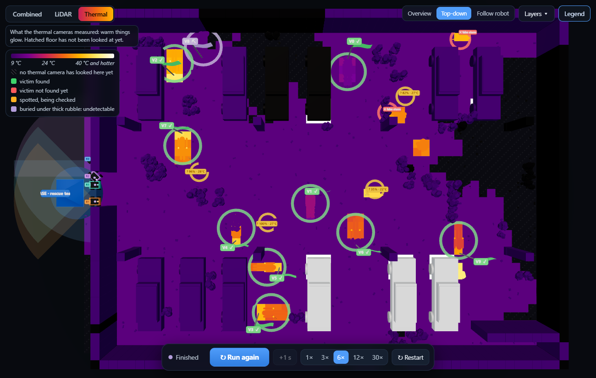

*A parking garage as the Thermal picture, seen from above: the building is cold (13 °C, dark
purple), people glow orange, cars whose engine ran recently glow white. Hatched floor has not
been looked at yet.*

**The victim map** (dashboard panel + *Export* button, or `GET /api/victim_map`): a JSON document
with

* `confirmed_victims`: position (metres), probability, number of sightings, robots that saw it,
  first sighting and confirmation times, temperature measured;
* `suspected_victims`: the same for unconfirmed sightings, plus how many close looks were taken;
* `rejected_sightings`;
* `unexplained_warm_spots`: warm clusters on the thermal map with no sighting nearby (a heater the
  AI ignored, a dog, a hot-water leak...) for rescuers to judge;
* `limitations`: the written reminder that cameras cannot see through thick rubble and that
  unsearched cells and confirmed locations need rescuers with listening devices or dogs;
* with a known victim count or after *Reveal*, `ground_truth_simulation_only` for checking.

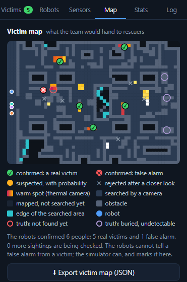

*The Map tab at the end of a mission, after* Reveal*: green ✓ real victims, red ✕ false alarms,
amber suspected locations with probabilities, orange warm spots, and rings for the ground truth
(purple: buried under thick rubble, which the robots could never have found).*

---

## 9. How a robot decides where to go

A robot only ever has two kinds of goals (`rescue/coordination.py`):

**Frontier goals: "search there".** A **frontier** is a searched free cell next to a cell no camera
has looked at yet: the edge of the searched area (frontier exploration, **Yamauchi, 1997**).
Frontier cells that touch are grouped; long ones are cut into pieces of about 10 cells so several
robots can work along one big opening. **Value** of a goal = number of cells in it (≈ how much new
area is behind it). The goal cell is the reachable cell nearest the piece's centre. Without LiDAR
the map and the searched area are the same thing, and this is plain frontier exploration.

**Verify goals: "check that sighting".** For every unconfirmed candidate, a free spot 0.7–2.2 m
away with a clear view (and away from earlier viewpoints). Value: a fixed **30**, scaled by the
current belief that it is a person, because confirming a person matters more than exploring a
corner.

**Distance** is the real driving distance on the robot's own map, computed with **Dijkstra's
algorithm**: 8 directions (0.5 m straight, 0.71 m diagonal), only through FREE cells, and no corner
cutting. So a robot never plans through a wall it has not seen. With LiDAR the map reaches 8 m in
every direction, so routes are planned through rooms the cameras have not searched yet, walls are
known before the robot drives up to them, and the team drives less.

**When robots decide:** when they have no goal, when they arrive (after a 360° scan), when the goal
becomes useless (a teammate explored that frontier, the sighting was already confirmed), and every
12 s anyway to use new information.

### When the sensors cannot see any further

Frontier exploration alone can get stuck: a robot drives to a frontier, looks, learns nothing new
(a table top hides the far side of a room from the laser; a camera cannot see into a corner), picks
the same frontier again and stands there. Earlier versions did exactly that: a LiDAR-only team could
sit idle for hundreds of seconds at about 97 % mapped. Three rules now make sure the search always
ends, and ends complete:

| Rule | What the robot does | Why it is safe |
|---|---|---|
| **The floor under a robot is free** | the cell a robot stands on is marked free with full certainty | the robot is standing on it |
| **Probe** | standing on a frontier it has already looked from, the robot drives slowly into the unknown cell next to it | it either gets in (the cell is free, and its laser now sees from inside) or the bumper stops it (an obstacle); a cell still unresolved after one probe is *given up* and no longer a frontier |
| **Drive through a doubtful obstacle** | when unexplored space is sealed off only by cells that just the laser calls blocked (beams grazing the jambs of a narrow doorway can "end" inside the opening), the robot takes the cheapest way through them, preferring weak evidence | the bumper settles every cell for good; a robot stops trying after 4 real obstacles, and a robot with no way back to base on its map takes the same careful route home or waits where it is |

The laser model was also made more exact: a beam's range is measured to 1 cm where it meets a
surface (it used to be up to 8 cm too long), and the hit is placed only 3 cm behind the surface, so
a beam clipping a corner no longer marks the empty cell beyond as an obstacle.

Result on 36 LiDAR-only missions (six buildings × six seeds, 3 robots): every mission finishes with
all robots back at base, **99.98 %** mapped on average and **100 %** in 31 of them. The rest miss at
most 0.3 % of the floor: a single cell tucked into a corner that the laser mislabels (no free cell
next to it on the map, so no robot has a reason to go there), or space between warehouse racks where
the robots bumped into real rack uprights four times and stopped trying. Camera missions reach
100 % mapped and searched and never need a probe.

---

## 9a. Navigation in depth: routes, coverage, obstacles, energy

A robot's decisions happen at three levels, each with its own module:

```
  WHERE TO GO NEXT      coordination.py + coverage.py   which unsearched spot (frontier) or sighting, in which order
        │
  WHICH ROUTE THERE     planners.py                     Dijkstra | A* | RRT* | ant colony, on the robot's own map
        │
  THE VERY NEXT STEP    motion.py                       follow the route or DWA; time, energy, dead ends
```

### How a robot moves (motion.py)

A robot turns on the spot, then drives straight (a differential-drive or tracked robot). A move to
a neighbouring cell at distance *d* (0.5 m straight, 0.71 m diagonal) with a heading change Δθ
takes

  **t = |Δθ| / ω + d / v**   (v = speed, default 0.5 m/s; ω = 180 °/s)

Each simulated second gives a robot one second of driving time; a move starts while time is left
and its duration is subtracted (a long move borrows from the next second). So a robot really drives
at *v*: a diagonal takes √2 times as long as a straight step and sharp turns cost time. (Before
this, every step took exactly one second whatever its length or angle.)

**Energy** of a 25 kg robot: all the time it works, P_base = computer 15 W + LiDAR 8 W + cameras
6 W; driving costs rolling resistance through the drivetrain, *m g C_rr / η* = 25 × 9.81 × 0.05 / 0.6
= **20 J per metre**, plus motor losses *k v²* (k = 12 W s²/m²); turning on the spot scrubs the
tracks, *m g μ (b/2) |Δθ| / η*. Driving at 0.5 m/s with both sensors, that is about 42 W, so
**1 Wh lasts about 85 s**. The test floor is small (28 × 20 m), so only 1–3 Wh batteries run low
within a mission; a real robot carries a few hundred Wh for a far larger site.

**Battery** (the same for every robot, or different per robot), three rules:

* **Energy-aware task choice.** Before a robot takes a task (frontier, sighting, pattern
  waypoint), it checks it can drive there (d), work there (a 5 s scan), and still get home (d_home,
  from a distance field grown from the base on its own map):
  1.3·(e·d + P·(d/v + 5 s)) + 1.3·(e·d_home + P·d_home/v) + 5 % of capacity ≤ energy left.
  Tasks that do not fit are left to teammates with more charge.
* **Turn home in time.** On the way it heads home as soon as only 1.3 × the drive back + 5 % is left.
* **Recharge and resume** (*At base: Recharge*): it docks at the base, charges at 60 W (1 Wh per
  minute), and goes back out, continuing its coverage pattern at the waypoint where it stopped.
  With *Stay* it remains at the base and its area is left to the others. If even a full battery
  cannot reach anything that is left, the robot says so and stays home (no endless docking).

At 0 J a robot stops where it is (this does not happen with the rules above; the tests check it).
The 3-D view shows each robot's charge on its name tag (green, amber below 45 %, red below 20 %,
⚡ while charging); the Robots tab shows capacity, charge, trips to the charger and time charging.

### Which route (planners.py)

All four planners work on the robot's own map with the same rules (FREE cells only, 8 directions,
straight step 1, diagonal 1.4142, no corner cutting, optional extra cost per cell), so they can be
compared fairly. The goal is always chosen with one Dijkstra distance field (the robot must compare
many goals at once); the planner then plans the route to the chosen goal.

| Planner | How it works | What it is good at |
|---|---|---|
| **Dijkstra** | expands cells in order of route cost g | always the shortest route; searches evenly in all directions |
| **A\*** | expands in order of f = g + h, h = octile distance max(dx,dy) + 0.4142·min(dx,dy) | h never overestimates, so the same shortest route as Dijkstra, with 3–10× fewer cells expanded |
| **RRT\*** | two random trees (from the robot and from the goal) of straight lines join the cheapest neighbour within r = γ√(log n / n) and rewire neighbours through each new point (a rewired point passes its saving on to its whole subtree, so cost(child) = cost(parent) + \|edge\| always holds); once a route of cost c exists, samples come only from the ellipse \|p−start\| + \|p−goal\| ≤ c (Informed RRT*); the final route is shortcut along lines of sight and drawn onto the grid with Bresenham's line algorithm, so every straight piece costs exactly its octile length | routes at any angle in open space; random, so different every run; narrow doors are hard to hit by chance, and then it falls back to A* (and says so) |
| **Ant colony** | 10 ants walk towards the goal choosing the next cell with probability ∝ τ^α η^β (τ pheromone, η = 1 / (1 + detour), detour = step + h(next) − h(here) ≥ 0 = how much the move lengthens the best route still possible, h = octile distance to the goal; α = 1, β = 4), backtracking out of dead ends; arriving ants lay Q / L, pheromone evaporates by ρ = 0.3 per round, the best route is reinforced; stops after 3 rounds without improvement | a nature-inspired search that finds good (not always shortest) routes; random |

Measured on 40 random routes on the open test ground (`python scripts/check_algorithms.py`;
`tests/test_navigation.py` checks the same properties): Dijkstra and A* always give the optimal
length; A* expands 87 cells on average against 974 (1.1 ms against 9 ms). RRT* routes average
1.013× the optimum (worst 1.085, 48 ms), the ant colony 1.011× (worst 1.089, 100 ms); all 40
routes of both are valid and none needed the A* fallback.

Two corrections made these numbers what they are. RRT* used to trace its straight lines onto
the grid cell by cell along the exact line, which turns every slanted line into a staircase of
straight steps (a line 10 right and 3 down cost 13 instead of 11.2): its routes averaged 1.18× the
optimum. And the ants' η = 1 / (step + distance to goal) hardly distinguishes neighbouring cells
far from the goal ((41/40)^4 ≈ 1.1), so the ants mostly wandered: 1.25× the optimum at 370 ms.

The **planner search** layer shows, for the selected robot, what its planner looked at: the cells
Dijkstra or A* expanded, the RRT* trees, or the cells the ants left pheromone on. The Robots tab
shows each route's length, the work done and the time taken.

### How the building is covered (coverage.py)

* **Frontier-based exploration** (Yamauchi 1997), the default: no fixed path. A robot drives to
  the edge of the searched area, looks, and chooses again; *which* edge is the strategy's choice
  (nearest for greedy, value − 0.5 × distance in the auction, own zone for partition).
* **Lawnmower (boustrophedon)** and **spiral**: fixed paths. The building's rectangle (known to
  rescuers; its inside is not) is split into one equal rectangle per robot, an r × c grid chosen
  to make them as square as possible, and robots are matched to rectangles so the total drive to
  the pattern starts is shortest (Hungarian method). Each robot then drives its own pattern:
  * lane spacing w = 2·R·sin(F/2)·(1 − 0.25): a forward camera of range R and field of view F
    sees a band 2·R·sin(F/2) wide as it drives, and neighbouring lanes overlap by 25 % (5.3 m for
    the default 5 m, 90° camera; 1.5 × the LiDAR range for a LiDAR-only team);
  * **lawnmower**: K = ⌈D / w⌉ lanes parallel to the rectangle's *longer* side (fewest lanes, so
    fewest turns), lane k at a₀ + (k + ½)·D / K, alternating direction. Neighbouring lanes are at
    most w apart and the outer ones at most w / 2 from the edge;
  * **spiral**: from a corner, the top edge, right edge, bottom edge and left edge, each edge
    moving in by one spacing once driven, until opposite edges meet. The passes lie on the same
    lines as the lawnmower's, so the same spacing guarantee holds;
  * the pattern starts in the rectangle corner nearest the robot. It is cut into waypoints every
    1.5 m, and the robot drives from one to the next with the chosen route planner. It assumes
    unmapped ground is free and replans when its sensors show an obstacle on the route. A
    waypoint that turns out to be inside an obstacle, or unreachable, is skipped (a red × in the
    3-D view);
  * a sighting within 6 m is checked on the way (one robot per sighting). Once its pattern is
    done, the robot searches what the patterns missed (behind obstacles) by frontier exploration,
    so every mode ends only when nothing reachable is left unsearched.

The **Coverage patterns** layer draws each robot's pattern (dashed; dot = start, ring = next
waypoint) and **Where each robot has driven** its real track, so you can see how closely the robots
follow it. The Robots tab shows the waypoint count, how many were reached and how many skipped.

**Open test ground** (building *plain*): one hall, a 2 × 2 m block in the middle, two crates,
cabinets in the four corners, shelves and counters along the walls, a painted 2 m grid, no
rubble and no look-alikes; the obstacles are the same every time. Made for checking the
algorithms. `python scripts/check_algorithms.py [--robots N] [--planner P]` runs every
pattern there and writes `results/algorithms/check.md` and `coverage.png`. With 1 robot and the
default 5.3 m spacing: the lawnmower (4 lanes, 108 m) reaches 75 of 77 waypoints (2 lie on a
victim), keeps to its lanes within 0.21 m on average (the grid's cells are 0.5 m), and has searched
97 % of the ground when it is done; the spiral (2 rings, 95 m) 67 of 68 waypoints, 0.29 m, 97.5 %.

### Obstacles, teammates and dead ends (motion.py, simulator.py)

* **Replanning.** Every second the robot checks the next 20 cells of its route against its map;
  when the LiDAR or the camera shows a new obstacle there, it plans again at once instead of
  driving up to it. The bumper still catches what no sensor saw.
* **Follow the route** (default): drive cell by cell; a teammate in the way means waiting, and after
  3 s planning around it.
* **Dynamic Window Approach** (Fox, Burgard & Thrun 1997): every step, each reachable neighbouring
  cell (free, no teammate, no corner cutting) is scored
  **G = 0.45·heading + 0.25·clearance + 0.30·progress − 0.10·turn**, where heading is the alignment
  with the route two cells ahead, clearance the distance to the nearest obstacle or teammate (up to
  3 cells, from a Euclidean distance transform), progress the drop in the local cost-to-go
  min_j [octile(c, route_j) + route length from j to 4 cells ahead], and turn the heading change.
  The robot keeps away from walls and steers round teammates instead of waiting.
* **Avoid revisits**: every cell costs 0.3 extra per earlier team visit (up to 5), so routes prefer
  ground nobody has driven over; the *Repeat visits* layer shows cells driven through more than once.
* **Dead-end recovery**: a robot that has been in at most 4 different cells during its last 24 s of
  driving (going back and forth), or blocked for 8 s, backs off along its own trail by at least 4
  cells and puts the goal it was heading for on a 60 s "tabu" list.

### What the options do (measured)

Same six missions for every row (office, warehouse, hospital; two seeds each; 4 robots, coordinated,
perfect-eyes vision), averages:

| Setting | Mission time | Distance | Energy | Moves over ground already driven | Waits for a teammate | Planning per route |
|---|---|---|---|---|---|---|
| Frontier + Dijkstra + follow route (default) | 279 s | 449 m | 15.0 Wh | 42 % | 14.5 | 14 ms |
| A* | 310 s | 497 m | 16.7 Wh | 44 % | 13.8 | **1 ms** |
| RRT* | 357 s | 540 m | 20.7 Wh | 46 % | 15.2 | 206 ms |
| Ant colony | 360 s | 531 m | 19.4 Wh | 39 % | 12.3 | 227 ms |
| Lawnmower | 312 s | 503 m | 16.6 Wh | 44 % | 13.2 | 14 ms |
| Spiral | 318 s | 512 m | 16.6 Wh | 46 % | 19.2 | 13 ms |
| DWA | 300 s | 475 m | 16.1 Wh | 43 % | **3.0** | 14 ms |
| Avoid revisits | 302 s | 470 m | 15.6 Wh | **33 %** | 6.3 | 4 ms |
| Speed 1.0 m/s | **180 s** | 489 m | **13.2 Wh** | 45 % | 13.0 | 14 ms |
| Battery 3 Wh | 211 s | 340 m | 11.3 Wh | 40 % | 12.7 | 13 ms |
| Rubble 2× | 305 s | 479 m | 16.1 Wh | 46 % | 15.0 | 13 ms |

The RRT*, ant colony, lawnmower and spiral rows above were measured before the planners were
corrected and the patterns became real sweeps (see *Which route* and *How the building is covered*).
Re-measured afterwards on six missions of the same kind (office, warehouse, hospital; seeds 0
and 1; 4 robots, coordinated, perfect vision), with its own baseline:

| Setting | Mission time | Distance | Energy | Moves over ground already driven | Waits for a teammate |
|---|---|---|---|---|---|
| Frontier + Dijkstra (default) | 317 s | 508 m | 16.9 Wh | 46 % | 13.2 |
| RRT* | 350 s | 542 m | 19.2 Wh | 45 % | 17.2 |
| Ant colony | 351 s | 533 m | 18.9 Wh | 43 % | 14.0 |
| Lawnmower | 390 s | 640 m | 20.0 Wh | 48 % | 16.2 |
| Spiral | 377 s | 628 m | 19.8 Wh | 49 % | 18.2 |

All 30 missions searched 100 % with every robot back at base. In walled buildings the fixed
patterns now cost 20–25 % more driving than frontier exploration, as expected: many lane
waypoints lie inside rooms reached only through a door far away.

Every row searched 100 % of the building with every robot back at base, except the 3 Wh battery:
the robots turned home in time (no battery ran flat) and left 7.7 % unsearched. How to read it:

* **A* versus Dijkstra**: both always plan equally short routes. When several routes are equally
  short they pick different ones, and over a whole mission that alone moves the time by ±10 %
  (six missions are too few to average it out). The real difference is effort: 1 ms against 14 ms.
* **RRT* and the ant colony** plan longer routes on a grid building full of walls and doors, and
  take 200 ms per route. They are built for other problems (continuous space, changing costs).
* **Lawnmower and spiral** follow their fixed paths and so drive more than frontier exploration in
  a building whose walls cut the lanes (many waypoints fall inside walls and rooms are entered
  from the wrong side); they suit open halls such as the test ground.
* **DWA** almost removes waiting for teammates (3 against 14.5) at the cost of 7 % more time,
  because it keeps clear of walls. **Avoiding revisits** cuts driving over the same ground from 42 %
  to 33 % of moves.
* Dead ends were rare in these buildings (0–0.2 per mission): with the probing of section 9 the
  robots seldom get stuck, and the recovery is there for when they do (tested in
  `tests/test_navigation.py`).

Compare the options yourself in the dashboard: **Stats → Compare algorithms** runs the current
mission once per option (same building, same random numbers) in the background and highlights the
best value in each column.

### Why the same settings give the same path

Every random choice in a mission (sensor noise, tie-breaks between equally good goals, RRT*
samples, ant choices) comes from a random number generator started from the building's seed. The
same settings therefore always produce exactly the same mission: that is what makes comparisons
fair. Set **Runs → Vary** (or `vary=1`, or `run_seed` on the command line) to keep the building
but draw new random numbers each run: the robots then take different paths.

---

## 10. The four team strategies

Every robot's current choice and its reason are shown live in the **Team decisions** panel, and the
**"robots aiming at the same spot"** number shows how well a strategy spreads the team.

### Random (baseline)
Each robot picks any reachable goal at random. It exists to show how much real strategy helps.

### Greedy (nearest goal)
Each robot takes the goal **nearest to it** and ignores its teammates. This is classic
single-robot frontier exploration. Because all robots start at the entrance, they often chase the same
frontier in a convoy. *Reason shown:* "nearest goal (teammates ignored)".

### Partition (zones), strict
1. At the start the **building outline** is split into one compact zone per robot with **k-means**
   clustering (only the outline is used; the robots do not know the inside).
2. A robot takes the nearest frontier or sighting **inside its own zone only**.
3. If nothing in its zone is reachable on its map yet, it plans a path **through unexplored space**
   straight to its zone (*"driving to my zone Z2, only passing through other zones"*). It never
   explores along the way. If an unseen wall is in the way, the bumper stops it and it replans.
4. When its zone is completely searched, it **goes back to base**. It never helps in a teammate's
   zone.

Measured over missions in every building type: **0 goals ever chosen outside the robot's own
zone**. About 80 % of the time robots are inside their zone; the rest is the drive there and back.

### Coordinated (auction)
The robots negotiate with a **sequential auction** (**Burgard et al., 2005**):

```
utility(robot, goal) = value(goal) − 0.5 × distance(robot, goal)       (distance in metres)
```

1. Find the (robot, goal) pair with the **highest utility**; give that goal to that robot.
2. Update the other goals: a sighting can only be checked by **one** robot; a frontier within 2 m of
   a taken one is removed; a frontier within 4 m loses value in proportion
   (`value × distance / 4 m`), because the teammate will see most of that area anyway.
3. Repeat until every robot has a goal. Goals already held by teammates count as taken.
4. If there are more robots than distinct goals (e.g. one doorway at the start), the spare robots
   go where they overlap least with their teammates.

**Worked example**, two robots at the entrance, three frontiers:

| | A (value 20, 6 m) | B (value 18, 3 m, 1.5 m from A) | C (value 12, 10 m) |
|---|---|---|---|
| utility | 20 − 3 = **17** | 18 − 1.5 = **16.5** | 12 − 5 = **7** |

Round 1: **R0 takes A**. B is 1.5 m from A, so it is removed (closer than 2 m). Round 2:
**R1 takes C**. The robots head in different directions instead of both going to A and B.

---

## 11. Known vs unknown number of victims

| | Known | Unknown (the usual real-life case) |
|---|---|---|
| Robots told | how many people are inside | nothing |
| Robots stop | as soon as they have **confirmed that many** | when the **whole reachable building** has been searched and no sighting is left to check |
| You see | every victim from the start (red / amber / green / purple flags) | only victims the robots have found; the number actually inside stays hidden (even from the web page and the mission log) until you press *Reveal* at the end |

**The trade-off:** with perfect eyes, knowing the count ends missions earlier. With an AI
detector, a false alarm counts toward the number too, so the robots can stop too early and miss
a real person. And when someone is buried under thick rubble the count is never reached, so the
robots search everything anyway and come home with "1 still missing", which is exactly what should
happen: that person needs a different kind of search.

---

## 12. How robots move without crashing

* One cell (0.5 m) per second along the path, facing the direction of travel.
* **360° scan** (four 90° turns) on reaching a frontier; **turn and look** for 2 s at a verify spot.
* **Collision avoidance:** before anyone moves, all moves are checked: no two robots in one
  cell, no robot moving into a cell whose occupant is not leaving, and no two robots swapping
  cells. The check repeats until nothing changes.
* **Stuck:** a robot blocked for 3 s replans treating teammates as obstacles.
* **Bumper:** a move into a cell that is really blocked marks it as an obstacle for good and
  triggers a replan. This is how obstacles too low for the LiDAR are found when no camera has
  looked at them yet.

The tests check every step of complete missions: never two robots in one cell, never a robot
inside an obstacle.

---

## 13. Measuring performance

`rescue/metrics.py` scores every mission against the ground truth:

| Metric | Meaning |
|---|---|
| **confirmed by the robots** | people the team reports, each person once (repeated reports merged) = victims found + false alarms |
| **victims found / recall** | real victims with a confirmed report within 1.5 m (one report counts one person) |
| **recall (detectable)** | the same, counting only victims a camera could see: not the ones under thick rubble |
| **buried under thick rubble** | victims with no heat signature; reported, never hidden in an average |
| **under thin debris found** | the thermal-only cases: faint signature, invisible to the colour camera |
| **false alarms / precision** | confirmed reports with no real person there, split into **warm objects** (heaters, pets, hot water, engines) and **look-alikes** (jackets, bags, boxes) |
| **too hot, dropped** | detections the physics check threw away (> 40 °C) |
| **time to first / 50 % / all detectable victims** | seconds of mission time: the headline rescue number |
| **time to 90 % mapped** | how fast the reachable area got onto the map (LiDAR or camera) |
| **time to 90 % searched** | how fast the reachable area was covered by cameras |
| **bumper hits** | times a robot drove into something its map did not show |
| **robots aiming at the same spot** | share of robot pairs whose goals are within 2 m (wasted effort) |
| **redundancy** | average number of robots that saw each searched cell (1.0 = no duplication) |
| **distance driven** | team total, a stand-in for battery use |

---

## 14. Results

> **Note (Sep 2026).** The tables in this section were measured with the earlier confirmation rule
> (detection 0.85, evidence 6.0, 4 frames) and before the team-verdict fix of section 7.3. The
> current rule (0.92, 9.0, 6 frames) has markedly fewer false alarms at the cost of 1–3 confirmed
> victims per 108; section 7.4 has the before/after comparison on unseen missions, and
> `python scripts/reliability.py` measures the current behaviour.

All numbers come from **buildings never used for training or tuning**: 4 buildings of each of
the six types (24 per row, seeds 200+), 4 robots, 10 victims, 12 look-alikes, 6 warm objects,
moderate damage, victim count unknown, LiDAR on unless stated, 900 s limit. Every vision mode and every strategy faces
exactly the same buildings, so the comparisons are fair. The ± values are the spread across
buildings (some are simply harder). "All found (s)" means all *detectable* victims, averaged
over the runs that reached it; the last column counts them.

### Does the thermal camera help? (partition strategy)

| vision | 50 % found (s) | all found (s) | recall (detectable) | under thin debris found | precision | false alarms: warm objects | false alarms: look-alikes | too hot, dropped | 90 % searched (s) | all found in |
|---|---|---|---|---|---|---|---|---|---|---|
| **colour camera** | 82 ± 28 | 173 ± 35 | 90 % | 0/12 | 72 % | 1.4 ± 0.9 | 1.4 ± 0.8 | 0.0 ± 0.0 | 136 ± 27 | 11/24 runs |
| **thermal camera** | 71 ± 31 | 156 ± 45 | 99 % | 12/12 | 78 % | 1.5 ± 1.0 | 0.1 ± 0.3 | 0.4 ± 0.9 | 131 ± 30 | 21/24 runs |
| **fusion (both)** | 71 ± 30 | 159 ± 47 | 98 % | 12/12 | 83 % | 1.1 ± 0.9 | 0.2 ± 0.5 | 0.3 ± 0.8 | 135 ± 31 | 21/24 runs |
| **perfect eyes** | 55 ± 28 | 135 ± 48 | 100 % | 12/12 | 100 % | 0.0 ± 0.0 | 0.0 ± 0.0 | 0.0 ± 0.0 | 117 ± 26 | 24/24 runs |

Across these 24 buildings 236 people were inside, 18 of them buried under thick rubble (no camera can detect them; excluded from 'recall (detectable)' and reported by every mission).

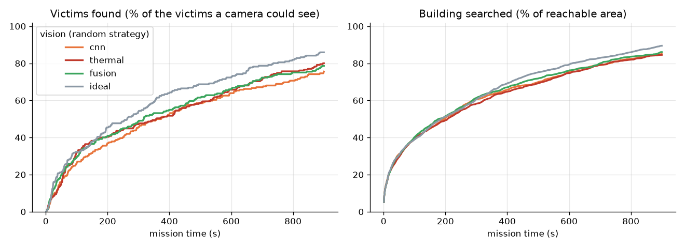

**Reading the table**

* **The thermal camera finds almost everyone a camera can find:** 99 % of the detectable victims,
  against 90 % for the colour camera. Most of the difference is the 12 people lying under thin
  debris: the thermal and fusion detectors found all 12, the colour detector none.
* **Each camera is fooled by different things.** The colour camera confirms 1.4 look-alikes
  (jackets, bags, boxes) per mission, the thermal camera 0.1, because a jacket is cold. Warm
  objects fool both about equally often (1.4 and 1.5 per mission): a dog or a heater has a shape
  as well as a temperature.
* **Fusion has the fewest false alarms:** 1.9 per mission, against 3.3 for colour and 2.5 for
  thermal. That is why its precision is the best (83 %).
* **No camera finds the 18 people under thick rubble.** Even perfect eyes reach only 93 % of all
  236 victims.

### Team strategies, per vision mode

#### Colour camera

| strategy | 50 % found (s) | all found (s) | recall (detectable) | precision | 90 % mapped (s) | 90 % searched (s) | distance (m) | redundancy | all found in |
|---|---|---|---|---|---|---|---|---|---|
| random | 352 ± 205 | 721 ± 94 | 76 % | 67 % | 538 ± 223 | 680 ± 213 | 1780 ± 334 | 3.38 ± 0.19 | 2/24 runs |
| greedy | 116 ± 30 | 219 ± 45 | 92 % | 70 % | 160 ± 48 | 181 ± 47 | 582 ± 129 | 2.80 ± 0.35 | 14/24 runs |
| partition | 82 ± 28 | 173 ± 35 | 90 % | 72 % | 112 ± 34 | 136 ± 27 | 422 ± 88 | 1.91 ± 0.25 | 11/24 runs |
| coordinated | 97 ± 35 | 204 ± 64 | 91 % | 69 % | 152 ± 47 | 175 ± 45 | 684 ± 155 | 2.89 ± 0.28 | 11/24 runs |

#### Thermal camera

| strategy | 50 % found (s) | all found (s) | recall (detectable) | precision | 90 % mapped (s) | 90 % searched (s) | distance (m) | redundancy | all found in |
|---|---|---|---|---|---|---|---|---|---|
| random | 357 ± 229 | 672 ± 251 | 80 % | 68 % | 520 ± 226 | 653 ± 196 | 1796 ± 261 | 3.38 ± 0.21 | 7/24 runs |
| greedy | 97 ± 35 | 186 ± 39 | 97 % | 75 % | 153 ± 46 | 176 ± 46 | 561 ± 128 | 2.77 ± 0.37 | 17/24 runs |
| partition | 71 ± 31 | 156 ± 45 | 99 % | 78 % | 109 ± 37 | 131 ± 30 | 450 ± 104 | 1.93 ± 0.22 | 21/24 runs |
| coordinated | 90 ± 43 | 209 ± 68 | 98 % | 72 % | 147 ± 47 | 177 ± 53 | 621 ± 127 | 2.78 ± 0.21 | 20/24 runs |

#### Fusion (both)

| strategy | 50 % found (s) | all found (s) | recall (detectable) | precision | 90 % mapped (s) | 90 % searched (s) | distance (m) | redundancy | all found in |
|---|---|---|---|---|---|---|---|---|---|
| random | 348 ± 222 | 671 ± 257 | 79 % | 70 % | 521 ± 221 | 641 ± 201 | 1796 ± 321 | 3.42 ± 0.17 | 7/24 runs |
| greedy | 106 ± 48 | 195 ± 43 | 97 % | 80 % | 158 ± 54 | 178 ± 52 | 562 ± 127 | 2.76 ± 0.29 | 18/24 runs |
| partition | 71 ± 30 | 159 ± 47 | 98 % | 83 % | 114 ± 41 | 135 ± 31 | 431 ± 98 | 1.94 ± 0.28 | 21/24 runs |
| coordinated | 84 ± 36 | 177 ± 49 | 99 % | 81 % | 138 ± 46 | 157 ± 42 | 593 ± 121 | 2.77 ± 0.27 | 21/24 runs |

#### Perfect eyes

| strategy | 50 % found (s) | all found (s) | recall (detectable) | precision | 90 % mapped (s) | 90 % searched (s) | distance (m) | redundancy | all found in |
|---|---|---|---|---|---|---|---|---|---|
| random | 267 ± 187 | 617 ± 214 | 86 % | 100 % | 537 ± 228 | 553 ± 177 | 1797 ± 330 | 3.36 ± 0.20 | 11/24 runs |
| greedy | 82 ± 36 | 165 ± 50 | 100 % | 100 % | 131 ± 43 | 147 ± 40 | 496 ± 116 | 2.59 ± 0.27 | 24/24 runs |
| partition | 55 ± 28 | 135 ± 48 | 100 % | 100 % | 97 ± 33 | 117 ± 26 | 359 ± 72 | 1.87 ± 0.23 | 24/24 runs |
| coordinated | 64 ± 29 | 133 ± 38 | 100 % | 100 % | 110 ± 37 | 126 ± 35 | 470 ± 100 | 2.48 ± 0.21 | 24/24 runs |

### Paired comparison, building by building

Median change against the **colour camera** with the same strategy (and in how many of the 24 buildings the mode was better):

| | thermal, partition | fusion, partition | thermal, coordinated | fusion, coordinated |
|---|---|---|---|---|
| time to find 50 % of victims | **-11 %** (17/24) | **-10 %** (15/24) | **-7 %** (13/24) | **-15 %** (17/24) |
| time to find all detectable victims | **-38 %** (18/24) | **-61 %** (19/24) | **-37 %** (16/24) | **-30 %** (18/24) |
| false alarms confirmed | **-12 %** (12/24) | **-50 %** (17/24) | +0 % (9/24) | **-50 %** (21/24) |
| recall (detectable victims) | **+6 %** (12/24) | **+6 %** (12/24) | **+11 %** (13/24) | +0 % (11/24) |
| trips to check a sighting | **-3 %** (13/24) | **-15 %** (19/24) | **-4 %** (13/24) | **-21 %** (19/24) |

Median change against **greedy** (and in how many of the 24 buildings the strategy was better), fusion vision:

| | partition | coordinated |
|---|---|---|
| time to find 50 % of victims | **-34 %** (23/24) | **-20 %** (17/24) |
| time to find all detectable victims | **-24 %** (19/24) | **-12 %** (16/24) |
| time to search 90 % | **-22 %** (23/24) | **-5 %** (17/24) |
| distance driven | **-24 %** (22/24) | +6 % (9/24) |
| robots aiming at the same spot | 52 % → **0.3 %** | 52 % → 12 % |

### Does the LiDAR help? (fusion vision, same 24 buildings)

| | partition, depth camera only | partition, with LiDAR | change | coordinated, depth camera only | coordinated, with LiDAR | change |
|---|---|---|---|---|---|---|
| time to find 50 % of victims (s) | 74 ± 32 | 71 ± 30 | **-1 %** (12/24) | 90 ± 43 | 84 ± 36 | **-3 %** (13/24) |
| time to find all detectable victims (s) | 167 ± 52 | 159 ± 47 | **-4 %** (16/24) | 213 ± 65 | 177 ± 49 | **-16 %** (17/24) |
| time to map 90 % of the building (s) | 136 ± 36 | 114 ± 41 | **-18 %** (20/24) | 174 ± 53 | 138 ± 46 | **-17 %** (21/24) |
| time to search 90 % of the building (s) | 136 ± 36 | 135 ± 31 | **-2 %** (13/24) | 174 ± 53 | 157 ± 42 | **-6 %** (17/24) |
| distance driven by the team (m) | 429 ± 81 | 431 ± 98 | **-2 %** (14/24) | 634 ± 136 | 593 ± 121 | **-3 %** (15/24) |
| bumper hits | 2.2 ± 2.6 | 1.0 ± 1.9 | - | 0.0 ± 0.0 | 0.2 ± 0.5 | - |

"Change" is the median over the 24 buildings, each compared with itself (and in how many buildings LiDAR was better).

### Team size (perfect vision, 12 buildings of all six types)

| robots | greedy: all found (s) | coordinated: all found (s) | coordinated: redundancy | speed-up vs 1 robot |
|---|---|---|---|---|
| 1 | 341 | 337 | 1.00 | 1.0x |
| 2 | 219 | 219 | 1.59 | 1.5x |
| 4 | 148 | 121 | 2.45 | 2.8x |
| 6 | 126 | 100 | 3.49 | 3.4x |
| 8 | 112 | 90 | 4.12 | 3.8x |

(Time to find every victim a camera could see; victims buried under thick rubble are excluded. Missions that never found them all count as 900 s, the time limit.)

### What the results show

1. **Thermal imaging finds people a colour camera cannot see.** Recall on detectable victims rises
   from 90 % to 99 %. With the partition strategy the team finds every detectable victim in 21 of
   24 buildings with the thermal or the fusion detector, and in 11 of 24 with the colour detector.
   The people under thin debris make the difference: 0 of 12 found with colour, 12 of 12 with
   thermal.
2. **Thermal alone is not enough; both cameras together are better.** A thermal camera is fooled by
   anything warm and body-sized (1.5 confirmed per mission). Reading colour and temperature
   together halves the false alarms of the colour camera (median −50 %, better in 17 of 24
   buildings with partition and 21 of 24 with coordinated) and gives the best precision: 83 %
   against 78 % (thermal) and 72 % (colour). The 40 °C check drops another 0.3 to 0.4 detections
   per mission before the AI's opinion counts.
3. **Cameras cannot see through thick rubble, and the numbers say so.** 18 of the 236 people
   (8 %) were buried under thick rubble. No vision mode found any of them, including perfect
   eyes. Those people need listening devices, search dogs or rescuers digging; the victim map
   carries that warning.
4. **LiDAR makes the map faster and the search a little faster.** With LiDAR 90 % of the building
   is mapped 17 to 18 % sooner (better in 20 and 21 of 24 buildings). All detectable victims are
   found 4 % sooner with partition and 16 % sooner with the auction, and the team drives 2 to 3 %
   less. The gain for the search is modest for a plain reason: a laser cannot search. Every cell
   still needs a look from a camera. A team with LiDAR only maps the building and finds nobody.
5. **Teamwork matters.** Greedy robots aim at the same spot 52 % of the time. Strict zones bring
   that to 0.3 %, the auction to 12 %. With zones the team finds half of the victims 34 % sooner
   (better in 23 of 24 buildings) and drives 24 % less.
6. **Strict zones (partition) are the most efficient strategy in every vision mode:** least
   duplicated work (1.9 robots look at each cell, against 2.8), least driving, and the shortest
   time to the first half of the victims. With fusion the auction finds the last victims about as
   reliably (21 of 24 buildings each).
7. **The belief filter makes an imperfect detector usable, but not perfect.** On single images the
   detectors are wrong in 17 to 28 % of their flags. After several looks and one close look, the
   fusion team still confirms about 2 false alarms per mission next to about 9 real victims.
   A rescuer would double-check every reported location.
8. **One person, one report.** About one repeated report per mission (head and legs of the same
   body) is merged instead of being counted as a second person or as a false alarm.
9. **More robots help, with diminishing returns:** 8 robots are 3.8× faster than one, not 8×,
   because they increasingly look at the same places.

---

## 15. Command line

```bash
python -m rescue serve                                        # 3-D dashboard, http://localhost:8001
python -m rescue simulate --building hospital --vision thermal --strategy partition --events   # one mission, told as a story
python -m rescue simulate --building parking --vision ideal --known --victims 6
python -m rescue simulate --building office --sensors cameras  # computer vision + thermal imaging, no LiDAR
python -m rescue simulate --building office --sensors lidar    # laser only: maps the building, finds nobody
python -m rescue benchmark --building all --vision all --seeds 4 --seed 200 --out results/vision   # every vision mode x every strategy
python -m rescue benchmark --building all --vision fusion --strategies partition coordinated --seeds 4 --seed 200 --no-lidar --out results/no_lidar
python scripts/rescue_experiments.py                          # team-size study
python scripts/check_algorithms.py --robots 2                 # planners + coverage patterns on the test ground
python -m rescue train                                        # re-train all three detectors (~1 h on CPU)
python -m rescue train --modality thermal                     # ...or just one of cnn | thermal | fusion
pytest                                                        # 57 tests
```

Options: `--building office|apartments|hospital|school|parking|warehouse|all`,
`--damage light|moderate|severe`, `--robots`, `--victims`, `--known`, `--seed`,
`--sensors lidar|cameras|both`, `--vision cnn|thermal|fusion|ideal|none|all`, `--no-lidar`,
`--max-steps`. All other numbers are in
`rescue/config.py`, `rescue/thermal.py` and `rescue/mapping.py`, each commented.
(The command line also has `--comm-range` to simulate limited radio between robots and a base
station; the dashboard always uses an ideal network.)

---

## 16. Project structure

The code is split by responsibility: the **world** (what exists), the **sensors** (what a robot
can measure), **perception and belief** (what it concludes), **mapping and coordination** (what it
does next), the **simulator** (the clock that runs them all), and the **dashboard** (what you see).

```
multi-robot/
├── rescue/                  the simulation (Python)
│   ├── config.py            every tunable number, with comments
│   │
│   ├── world.py             WORLD    six building types, furniture, collapse, rubble, victims, look-alikes
│   ├── thermal.py                    surface temperatures, warm objects, buried victims
│   │
│   ├── lidar.py             SENSORS  the 360° laser scanner: one noisy scan
│   ├── sensors.py                    colour, depth and thermal camera (ray-marched images), field of view
│   │
│   ├── perception.py        THINKING the three detectors: training data, network, detection, 40 °C check
│   ├── victims.py                    belief filter: sightings → candidates → confirmed / rejected
│   ├── mapping.py                    evidence grid (LiDAR + camera), searched layer, frontiers, Dijkstra
│   ├── coordination.py               the four team strategies and the reason behind every choice
│   ├── planners.py                   route planners: Dijkstra, A*, RRT* (bidirectional, informed), ant colony
│   ├── coverage.py                   coverage patterns: frontier, lawnmower (boustrophedon), spiral: regions, lanes, waypoints
│   ├── motion.py                     kinematics, energy and battery, Dynamic Window Approach, dead-end detection
│   │
│   ├── simulator.py         RUNNING  the sense → spot → share → believe → decide → move loop
│   ├── metrics.py                    scoring against the ground truth
│   ├── __main__.py                   command line: serve, simulate, benchmark, train
│   │
│   ├── server.py            DASHBOARD  local web server: mission state, camera images, victim-map export, comparisons
│   └── web/
│       ├── index.html                page layout only
│       ├── css/style.css             all styling
│       ├── js/main.js                start-up, mission phases (ready → running ⇄ paused → finished), playback loop
│       ├── js/controls.js            setup panel, transport bar, picture switch, Layers menu, keyboard, presets
│       ├── js/panels.js              top-bar numbers, mission summary, the six tabs
│       ├── js/charts.js              victim map, LiDAR plot, progress chart
│       ├── js/scene.js               3-D stage: renderer, lights, camera views, zoom and fly-to
│       ├── js/inspect.js             double-click selection, the spot card, zoom buttons, mouse tips
│       ├── js/sensorfx.js            the looks of the LiDAR picture (scan plane, point cloud, sweep) and Thermal glow
│       ├── js/world3d.js             builds the building once, repaints it as Combined / LiDAR / Thermal picture
│       ├── js/builders.js            walls, furniture, rubble, look-alikes, warm objects
│       ├── js/actors.js              robots with LiDAR scan, victims with flags, the base
│       ├── js/store.js  api.js  config.js  util.js     shared state, server calls, texts, helpers
│       └── vendor/                   Three.js library files (works offline)
├── streamlit_app.py         the same dashboard inside Streamlit (streamlit run streamlit_app.py)
├── .streamlit/config.toml   Streamlit settings (dark theme)
├── models/                  victim_detector.pt (colour), thermal_detector.pt, fusion_detector.pt (+ .json test scores)
├── results/                 benchmark tables and charts, screenshots
├── scripts/rescue_experiments.py     team-size study
├── scripts/check_algorithms.py      checks planners and coverage patterns on the open test ground
├── tests/test_rescue.py     57 tests
├── pyproject.toml  requirements.txt
└── README.md
```

**Technologies:** Python, NumPy / SciPy (simulation, maps, geometry, thermal blur), PyTorch (neural
networks), scikit-learn (evaluation), Pillow (camera images), Three.js / WebGL (3-D view),
Matplotlib (charts).

---

## 17. Glossary

| Term | Plain meaning |
|---|---|
| **Autonomous** | decides by itself from its own sensors, with nobody steering it |
| **RGB-D camera** | colour camera + depth sensor: each pixel also says how far away it is |
| **LiDAR** | a laser that measures distances by timing its own light; here a 2-D scanner that sweeps one horizontal plane |
| **Scan plane** | the height at which the laser sweeps (40 cm); anything lower is invisible to it |
| **Evidence grid** | a map whose cells hold how strongly the measurements so far say "occupied"; also called a probabilistic occupancy grid |
| **Mapped / searched** | mapped: the robots know whether they can drive there; searched: a camera has looked there for people |
| **Thermal camera** | measures the infrared radiation surfaces emit, i.e. their temperature; works in the dark |
| **Heat signature** | the warm patch a body leaves on a thermal image |
| **Ironbow** | the black-purple-orange-yellow-white colour scale thermal cameras use to show temperature |
| **Occupancy grid** | a map of squares, each unknown, free or obstacle |
| **Ray casting / ray marching** | follow a straight line from the sensor until it hits something |
| **Frontier** | the edge between explored and unexplored space; the robot's exploration target |
| **Dijkstra's algorithm** | finds shortest routes on a map by expanding outward from the start |
| **CNN** | convolutional neural network, the standard AI model for images |
| **Sensor fusion** | feeding several sensors (here colour, depth and temperature) into one decision |
| **Heatmap** (of the network) | small image where each pixel is a probability ("person here?"); not the thermal image |
| **Hard negatives** | training examples that look like the target but are not |
| **Log-odds / Bayesian update** | a way to add up evidence and update a belief |
| **Recall / precision** | share of real victims found / share of reports that were real |
| **Utility** | how worthwhile a goal is: value minus travel cost |
| **Auction** | robots compete for goals; best utility wins; the rest adjust |
| **k-means** | splits points into k groups; used to divide the building into zones |
| **Redundancy** | how many robots looked at the same place (wasted effort) |

---

## 18. Limitations and next steps

* **Cameras cannot see through rubble.** That is physics, not a bug, and the simulation keeps
  it. The next sensors to add would be the ones real teams use for buried victims: **acoustic
  listening** (tapping, voices), **ground-penetrating radar**, **CO₂ sensing**, and **search dogs**
  as a human-in-the-loop resource; the victim map already leaves room for "unsearched, needs
  another method".
* The temperature model is a static snapshot: no cooling of a body over the mission, no fires,
  no sun moving across a collapsed roof. Adding time would make "warm spots" age realistically.
* Robots move on a flat grid with perfectly known positions; a real robot must estimate its
  position from the LiDAR scans themselves (**SLAM**), and its map drifts. There is no physics
  engine; **ROS 2 + Gazebo** would be the next step toward real hardware.
* The LiDAR is a single horizontal plane and does not see the other robots. A 3-D LiDAR would
  also see low obstacles; the bumper and the depth camera cover for that here.
* The detectors are trained on the simulator's own graphics and temperatures; real use needs real
  or photo-realistic images and real radiometric data (**sim-to-real transfer**).
* Partition zones are split by area, not by how hard each zone is; smarter splitting (or letting
  finished robots take over unfinished zones) would balance the work.
* More AI: learn the exploration policy with **multi-agent reinforcement learning**; predict where
  victims are likely (near beds, desks, doorways) to prioritise frontiers; use the thermal map's
  unexplained warm spots as low-priority "check when free" goals.
